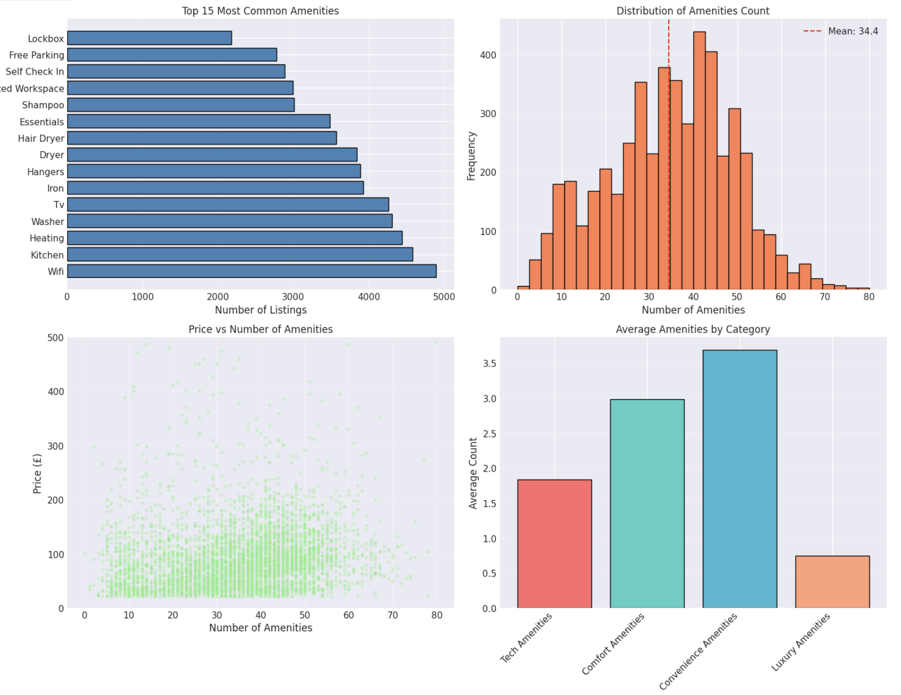

# Airbnb Price Project - Manchester

## Project Overview
This project develops an end-to-end machine learning system to predict nightly prices for Airbnb listings in Manchester, UK. Through comprehensive data preprocessing, exploratory analysis, and machine learning modeling, the project creates an interactive web application that provides hosts with data-driven pricing recommendations and strategic insights.

Key Technologies: Python, Pandas, Scikit-learn, XGBoost, Streamlit, NLP
Dataset: 7,151 Airbnb listings from Manchester with 79 original features
Final Model: XGBoost achieving 49.10% R² (£58.21 RMSE)
Deployment: Interactive Streamlit web application with real-time predictions


## Data Preprocessing & Feature Engineering

### Data Overview
The preprocessing begins with an Airbnb listings dataset containing 7,151 initial records. After careful selection and cleaning, I focused on 26 columns from the original datasets, prioritising features related to property characteristics, amenities, reviews, and host information. The final process dataset contains 5,430 listings with 207 engineered features in a modelling ready format. 

### Data Cleaning 
The data cleaning process started by analysing missing values across the columns. I identified columns with varying levels of missingness, particularly some in the 10-50% range. I implemented imputation strategies based on the feature. For numeric features like bathroom, bedrooms and beds, I used median imputation to maintain the central tendency of the distribution. Categorical features such as host response time were filled with an ‘unknown’ category to preserve information. Boolean features including superhost status and identity verification were filled with False for missing values, assuming the absence of a value indicated negative status. Ultimately, I dropped 856 listings that were missing the target variable of price as they could not be used in machine learning. 

For data type standardisation the price column required extensive cleaning to remove currency symbols and commas. The boolean columns were cleaned to ‘t’ and ‘f’ representation. Date columns like host since and last scraped were converted to datetime format for feature engineering. 

Outlier treatment was applied systematically across key numerical features using the Interquartile range method. For the price variable specifically, I clipped values to the 0.5th and 99.5th percentile which resulted in prices between £20 and £1,163.89, with 51 extreme outliers being clipped. The same method was applied to accommodates, bedrooms, beds, bathrooms and number of reviews to ensure that extreme values wouldn't affect the modelling process. 

### Advanced Feature engineering
The feature engineering process transformed the original 26 columns into 207. I created three features to capture the host’s experience including how many days and year they have been active calculated from the accounts creation date and I also calculated how many days since the last review to measure recency. I then engineered two price related features - price per person and people per bedroom to provide a normalised pricing metric. 

From the picture url field, I created eight features including URL, length, complexity scores, Mustache domain verification and estimated image quality levels ranging from original to standard. This analysis also included file format extraction and the creation of a quality scoring system that considers multiple URL characteristics. 

For the amenities processing I parsed JSON-like amenities strings into 13 distinct categorical groups covering basic amenities such as WiFi and kitchen facilities, safety features including smoke alarms and carbon monoxide detector, kitchen and dining equipment, bathroom amenities, bedroom and living space features, internet and office capabilities, entertainment options, outdoor and recreation facilities, luxury amenities like pools and hot tubs, transportation and location features, family and accessibility accommodation, pet-friendly amenities, and climate control options. This resulted in over 89 binary features indicating the presence or absence of specific amenities. Additionally, I created three amenity scoring systems: a basic amenities score ranging from 0 to 5 for essential necessities, luxury amenities score from 0 to 4 for premium features, and a convenience amenities score from 0 to 4 for practical facilities. An overall amenities count feature captures the total number of amenities per listing. 

Natural Language Processing played a significant role in extracting values from the text field. From the listing name I engineered 15 features including basic text statistics like length and word count, a luxury indicator score detecting words such as penthouse and villa, a location quality score identifying terms like central and downtown, property type mentions for apartments, houses and studios and loft, comfort descriptors including cozy and modern, privacy indicators, and view mentions. 

The description text analysis created 24 features through natural language processing. I calculated standard text statistics including length, word count, sentence count and average word length. A readability score was computed using the Flesch Reading Ease formulae to assess how accessible the description is to potential guests. Sentiment analysis employed a custom scoring system based on dictionaries of positive and negative words, providing insights into the emotional tone of descriptions. Theme-based mention counts were created across 14 categories including luxury, location, transport, experience, facilities, business amenities, safety, cleanliness, comfort, views, activities, food, family friendly features, and romantic appeals. Stylistic features capture the use of exclamation marks, question marks, capitalization ratio, and numbers within the description. 

Overall, I created three composite metrics. The overall text quality combines name features at 25% weight, description features at 50%, and amenities features at 25% weight into a single quality indicator. This score is then converted into a percentage and further categorised into six levels - basic, average, good, high, premium and exceptional. 

### Encoding Strategies
For the ordinal variable, I applied ordinal encoding the host response time to create an ordered scale to preserve the natural ordering. One-hot encoding was applied to several categorical variables - room type, property type, estimated image quality and text quality. To handle high cardinality categorical variables, I implemented a grouping strategy for property type, which originally contained 56 unique values. To prevent sparseness I selected the 15 top most common property types and grouped the remainder into an Other category. 

### Data Reduction and Final Dataset
To focus the dataset on predictive features, I removed several columns like IDs and dates as the relevant features have been extracted from them. Text fields were also removed once feature engineering had extracted the important information. Availability metrics were excluded as they are not directly relevant for pricing prediction. Redundant listing counts and other duplicates were also removed to ensure the machine learning model is as efficient as possible. The cleaned dataset has 207 features across different data types with 5439 records with no missing values ready for machine learning. 

## Exploratory Data Analysis 
The exploratory data analysis examined 4,088 Airbnb listings in Manchester, revealing a market with a median price of £80 per night and a strong guest satisfaction of 4.69/5. The analysis identifies property capacity as the primary price driver, while surprisingly finding that quality metrics like review scores and host characteristics show minimal correlation with pricing. After outlier treatment, prices range from £20 to £1,164 with the interquartile range spanning £40 to £120. 

### Price Distribution and Market Structure
The market shows right-skewed pricing with median £81 and mean £106. Distribution analysis revealed concentration in the £50-£120 range where most competition occurs. 


### Property and Room Type Analysis 
“Entire rental unit” dominated with 1,983 listings, followed by "Entire home” (1,660) and “Private room in home” (1,560). Entire properties average £171 versus £56 for private rooms, yet review scores remain consistent across types (4.67 - 4.75). 


### Host Analysis 
Superhosts represent 30% of listings and respond within an hour at 70% rates. Unexpectedly, Superhosts average slightly lower prices than regular hosts. 


### Geographical analysis 
Salford District leads with 1,482 listings, but Tameside District averages higher prices (£252 average). Manchester and Salford together account for 65% of the market, creating geographical pricing tiers from city center premiums to suburban value options. 


### Capacity and Physical Features analysis 
Two guest properties dominate (2,338 listings), with one bedroom (3,361) and one bathroom (3,680) the most common. Price scales linearly with capacity from £50 (single) to £221 (nine guests), confirming capacity as a primary price determinant. 


### Guest Satisfaction Analysis 
Average rating of 4.68/5.0 demonstrates high market quality. Communication scores are the highest (4.79) while value scores the lowest (4.62). Review dimensions show strong intercorrelation (0.66-0.91), indicating all round satisfaction. Notably, price weakly correlates with rating, providing budget properties can achieve excellence. 


### Amenities Analysis 
WiFi (98%), kitchen (92%), and heating (89%) are the most common amenities. Listings average 34.4 amenities with normal distribution. Amenity count shows weak price correlation (0.07), suggesting quality over quantity matters. 



### Text Quality and Presentation Analysis 
Listing names average 37 characters, description 395 characters. Text intelligence scores normally distribute around 11 points. High text quality properties achieve £11 premium over low quality (£104 vs £92), demonstrating modest but measurable presentation values. 


### Host experience analysis 
Host average 5.6 years experience with bimodal response rate distribution (spike at 100%). Experience shows no clear price relationship, and Superhost regular host pricing appears similar despite quality designation differences. 


### Engineered Pricing Metrics
Price per person average £37 with high variation. People per bedroom ratio (2.2) indicates reasonable capacity size alignment. Analysis confirms accommodates (0.48), bedrooms (0.46), and beds (0.41) as strongest price correlates, while host metrics and text quality show minimal correlation. 


### Feature importance and correlation 
Physical capacity metrics dominate price correlation. Host response rate (0.04) and text intelligence (0.06) shows negligible correlation with price but likely influence booking rates and reviews rather than pricing power. 


### Property type pricing variations
“Entire home” averages £140, “Entire rental unit” £106, “Private room in home” £42. Geographical concentration in Manchester and Salford creates distinct competitive submarkets 


### Market Segmentation 
Budget (<£50): 1,375 listings (27.6%), Mid-Range (£50-£100): 1,935 listings (38.8%), Premium (£100-£200): 1,400 listings (28.1%), Luxury (£200+): 278 listings (5.6%). All segments maintain 4.64-4.71 ratings. Superhost percentage declines from 37.8% (Budget) to 25.2% (Luxury).


### Operational Performance 
Instant bookable properties average £15 premium (£106 vs £91) but achieve slightly lower ratings (4.63 vs 4.73). Text quality premium reaches £11. Revenue indicator shows right skewed distribution with high performer concentration


### Multi-dimensional Relationships
Complex interaction analysis revealed that amenities distributed across all price rating combinations, bedroom counts create distinct capacity price zones, host experience spans all price ranges with systematic positioning, and superhost occupy similar price availability space as regular hosts. 


### Predictive Feature Summary
Final analysis confirmed accommodates (0.48) and bedroom (0.46) as dominant price predictors, followed by beds (0.41) and bathrooms (0.30). Review score and amenity counts show weak correlation, positing them as quality indicators rather than price drivers. 


### Strategic Quadrants 
Market is divided into Premium (25.1% - high price, high rating), Value (24% - low price, high rating), Budget (26.8% - low price, low rating) and Needs Improvement (24% - high price, low rating). Balanced distribution suggest no extreme concentration, with opportunities across all quadrants. 


### Key Insights 
The EDA established that successful price prediction prioritises physical capacity features as primary predictors. Quality metrics like reviews serve better as booking likelihood indicators than price predictors. Host characteristics show minimal direct price impact despite influencing long term success. Geographical location creates distinct submarkets requiring location based features. Amenities matter but show diminishing return, suggesting binary presence indicators for key amenities may outperform count-based approaches. Text quality offers incremental pricing improvements. The market supports diverse strategies across price tiers, each capable of achieving guest satisfaction when properly aligned with target expectation. 

## Machine Learning Modelling 
Multiple regression models were developed to predict Manchester Airbnb prices. An optimized XGBoost model achieved 98.33% validation R² (£11.12 RMSE) but suffered from data leakage. After removing the problematic price per person feature, the deployment model achieved a legitimate 49.10% test R² (£58.21 RMSE), with property capacity features (accommodates, bedrooms, beds) as primary predictors.

### Data Preparation 
Starting with 4,988 listings and 216 features, correlation filtering removed 16 highly intercorrelated features, reducing to 142 predictors. Initial Random Forest analysis revealed price per person dominated with 58.7% feature importance, signaling data leakage single it’s derived from the target variable. Data split 60% training (3,192), 20% validation (789), 20% test (998). RobustScaler applied to linear models with tree based models using the unscaled features. 


### Baseline Models 
Linear Models achieved moderate performance: Linear Regression (57.35% val R², £56.24 RMSE), Ridge (57.39%, £56.21), Lasso (56.15%, £57.02). Tree-based models substantially outperformed: Decision Tree (97.48%, £13.68), Random Forest (97.88%, £12.54). The 40 percentage point gap demonstrated tree models' superior ability to capture non-linear relationships. 


### Advanced Models 
Gradient boosting methods excelled: XGBoost (96.97% val R², £14.99 RMSE), LightGBM (97.81%, £12.75), Gradient Boosting (98.77%, £9.55—best single model), Extra Trees (97.62%, £13.28). The ensemble combining Gradient Boosting, Random Forest, and LightGBM achieved 98.37% R² (£11.01 RMSE) but didn't surpass Gradient Boosting alone.


### Cross Validation and Tuning 
Five fold CV revealed consistent performance XGBoost (96.12% mean R² ±0.96%, £17.36 RMSE ±£2.49), Random Forest (95.22% ±2.15%, £19.10 ±£4.56), LightGBM (94.66% ±0.61%, £20.63 ±£2.65). Randomised hyperparameter search over 15 XGBoost configurations identified optimal settings: n_estimators=200, max_depth=3, learning_rate=0.2, subsample=1.0, colsample_bytree=1.0. Tuned XGBoost achieved 98.33% validation R² (£11.12 RMSE), improving 1.36 percentage points over defaults.

Random Forest tuning (10 configurations) found: n_estimators=300, max_depth=None, min_samples_split=10, min_samples_leaf=2, max_features=None, achieving 97.50% validation R² (£13.62 RMSE). XGBoost selected as final model based on superior validation performance.

### Feature Importance Analysis
XGBoost feature importance: price per person (28.01%), accommodates (22.12%), bedrooms (10.15%), room_type_Private room (9.70%), name_view_score (6.49%), beds (5.02%), has_washer (3.35%), desc_location_themes_score (2.26%).


Permutation importance revealed even stronger concentration: price per person (1.829), accommodates (1.010), bedrooms (0.022), people_per_bedroom (0.016), beds (0.004), has_washer (0.002). Massive drop after top two features confirmed their dominant predictive power.


### Deployment Model Preparation 
Removing price per person eliminates data leakage. Retrained XGBoost achieved 49.10% test R² (£58.21 RMSE), representing legitimate predictive power. The 49-percentage-point drop (98.33% to 49.10%) quantified leakage impact. Deployment performance of 49.10% R² with £58 typical error (60% of median price) provides useful pricing guidance despite inherent market uncertainty. Model saved with scaler, feature list, and default values for production deployment.

### Key Insights
Gradient boosting outperformed linear models by 20-40 percentage points R². Extensive feature engineering provided modest returns with text features appearing in the top 20 but contributed minimally compared to core characteristics. Hyperparameter tuning added 1.36 percentage points but required substantial computation. The final 49.10% R² represents solid real-world performance, acknowledging that unmeasured factors create inherent prediction limits.

## Streamlit Application - Interactive Price Prediction Interface 
The Streamlit application provides a web-based interface where Manchester Airbnb hosts input property details to receive instant price predictions with actionable recommendations. The application integrates the complete preprocessing pipeline and trained XGBoost model into a form that delivers personalised pricing guidance.

### Technical Architecture
The application uses modular design separating UI from the processing logic and four artifact loads via joblib caching. The preprocessing module contains 13 amenity dictionaries (89 amenities), text analysis functions for NLP features, URL parsing for image quality, and the full pipeline transforming inputs into 214 features.

### User Interface
The two column layout maximises space while grouping all the related information together. The interface prompts the user to enter all the information regarding their Airbnb such as basic property info (name, description, URL), property details (type, capacity, rooms), location (33 neighborhoods with auto-populated coordinates), and host info (account age, response time, verification) as well as amenities via organized checkboxes (Essentials, Comfort, Premium, Safety) plus review sliders for seven dimensions.

Custom CSS matches Airbnb branding with coral red buttons , rounded corners, and appropriate spacing. Centered header with emoji and descriptive text immediately communicates purpose.

### Results Presentation 
After scaling and prediction, results display with prominent recommended prices, three metric cards (monthly estimate at 25 nights, per-person rate, ±15% confidence range), and feature impact analysis. Positive factors (hot tub +£22, City Centre +£18, excellent reviews +£8) appear left with checkmarks; negative factors (few reviews -£8, slow response -£6) appear right with warnings.

Competitive positioning compares predicted price to neighborhood benchmarks via Plotly bar chart, with interpretive text explaining market position (significantly below/above, competitive, premium). Three pricing strategies (Conservative -10%, Balanced, Aggressive +15%) show expected occupancy and use cases, with revenue projections table quantifying financial implications.

### Technical Implementations 
Comprehensive error handling wraps predictions in try-except blocks with expandable stack traces. Spinner indicates processing during 1-2 second feature extraction. Requirements include Streamlit 1.28.0, Pandas 2.1.0, NumPy 1.24.3, Scikit-learn 1.3.0, XGBoost 2.0.0, Joblib 1.3.2, and Plotly. Application runs with streamlit run app.py and deploys to cloud platforms within free tier limits.

### Strengths and Limitations 
The application successfully democratizes ML prediction through intuitive interface, replicates 214-feature preprocessing ensuring quality, and provides actionable insights beyond raw predictions. However, it inherits 49.10% R² model limitation, cannot capture seasonal dynamics or special events, uses approximated rather than rigorous confidence intervals, requires periodic market data updates, and employs rules-based impacts rather than SHAP values. Revenue projections assume static occupancy that varies in reality.

## Conclusion 
This end to end data science project developed a machine learning system for predicting Manchester Airbnb prices. From 7,151 raw listings, preprocessing produced 4,988 clean records with 216 engineered features. An optimized XGBoost model achieved 49.10% test R² (£58.21 RMSE) after correcting data leakage, with property capacity (accommodates, bedrooms, bathrooms) as primary predictors. A Streamlit application delivers predictions with competitive analysis and strategic recommendations.

### Key Achievements 
The project demonstrates full-pipeline data science capabilities: advanced preprocessing with 89 amenity features and NLP text analysis, exploratory analysis through 19 visualizations identifying capacity-price relationships and geographic segmentation, systematic machine learning experimentation across 9 models with hyperparameter tuning and rigorous evaluation, and practical deployment through an interactive web application providing actionable business intelligence.

### Future Enhancements
Potential improvements include temporal features for seasonality, ensemble stacking for additional signal, SHAP values for theoretically grounded explanations, dynamic market data integration, and A/B testing with actual hosts to validate business impact.

## Installation and Usage

### Requirements
```bash
pip install -r requirements.txt

Running the Application 
streamlit run app.py

### Project Files 
app.py - Streamlit web application
preprocessing.py - Feature engineering pipeline
*.pkl files - Trained model and preprocessing artifacts
requirements.txt - Python dependencies

### Author 
Name: Nicole Reeves
GitHub: github.com/NicoleReeves
Contact: nicole@reeves.co.uk


